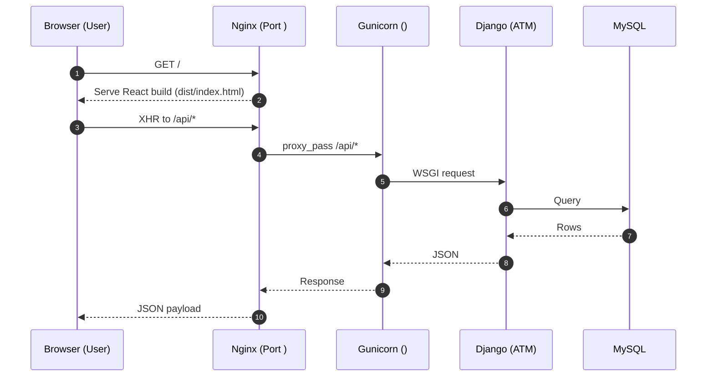

# Agreement Tracking System

A web-based system to create, manage, and monitor agreements within an organization. The application is built with:

Frontend: React (Vite)

Backend: Django (REST Framework)

Database: MySQL

The project provides role-based access control with Superusers, Regular Users, and Executives, ensuring secure management of agreements, departments, and permissions.

---
### Overview of the system 


---


## 🚀 Features
## 🔹 Frontend (React)  

- **User Authentication**  
  - Superuser creates regular users.  
  - Regular users log in using **email + password**.  

- **Dashboard**  
  - Interactive graphs and charts displaying agreements:  
    - By department  
    - By expiry dates (e.g., 6, 4, 3, 2 months)  

- **Agreement Management**  
  - Regular users can create agreements (restricted to assigned departments).  
  - Agreement lifecycle: **Preview → Submit → View/Edit**.  

- **Executives’ Access**  
  - Executives can **only view agreements** (no create/edit permissions).
    


## Frontend Part Code
> [👉Explore the latest branch: Atm_fproject](https://github.com/MariomEmu/Agreement-Tracking-System-/tree/new/version/Atm_fproject)


---

## 🔹 Backend (Django + MySQL)  

- **Administration Panel** (Accessible only by **Superuser**)  
  - Create and manage departments  
  - Create users (mark as active/inactive)  
  - Assign department permissions  
  - Add vendors and agreement types  
  - Manage agreements and permissions  
  - Only a superuser can **delete agreements**  

- **User Roles**  
  - **Superuser** = User + Staff Status + Superuser Status  
  - **Regular User** = Assigned to departments with specific permissions  
  - **Executive** = Can approve permissions, but cannot edit agreements  

- **Permission Flow**  
  - **Create Department** → **Create User** → **Assign Department Permission** → **Add Vendor** → **Create Agreement**  
  - To give extra department access: **Department → User → Department Permission**  
  - Permissions require **Executive approval**  
  - Deactivating a user (`Active = false`) removes system access
 
    

## Backend Part Code
  > [👉 Explore the atm branch](https://github.com/MariomEmu/Agreement-Tracking-System-/tree/new/version/atm)

 

  ---  


## 🎯 Role-Based Access Summary  

| Role         | Permissions                                                                 |
|--------------|-----------------------------------------------------------------------------|
| **Superuser** | Full access → create departments, users, vendors, agreement types, delete agreements, assign permissions. |
| **Regular User** | Login → view dashboard, create/preview/edit agreements in assigned department. |
| **Executive** | View agreements only, approve department permissions. |


---

## Deployment On Server

### 📦 RHEL 8.10 — Agreement Tracking Module (ATM) Deployment Guide

**Stack**

* **Frontend:** React (Vite)
* **Backend:** Django (Gunicorn)
* **Database:** MySQL
* **Web Server/Reverse Proxy:** Nginx
* **OS:** RHEL 8.10

> \[!IMPORTANT]
> This section is a project deployment guide step by step

---

## ✅ Prerequisites

* RHEL 8.10 server with sudo access
* Domain or server IP (e.g., `<SERVER_IP>`) reachable over port 
* Git + SSH access to your repository

Optional but helpful:

* `tree` for directory inspection, `firewalld` enabled

```bash
sudo dnf install -y epel-release
sudo dnf update -y
sudo dnf install -y python3 python3-pip python3-virtualenv mysql-server nginx nodejs npm tree
sudo systemctl enable --now mysqld
sudo systemctl enable --now nginx
```

> \[!TIP]
> If `mysqlclient` build fails during `pip install`, add build tools:
> `sudo dnf install -y gcc gcc-c++ make python3-devel mariadb-connector-c-devel pkg-config`

---

## 🔐 Security Notes (Public README Safe)

* Don’t commit `.env`, private keys, or real passwords.
* Use strong DB/user passwords via env vars or a secrets manager.
* In Django, set `DEBUG=False` and configure `ALLOWED_HOSTS` for `<SERVER_IP>` or your domain.

```python
# settings.py
DEBUG = False
ALLOWED_HOSTS = ["<SERVER_IP>", "your.domain.com"]
```

---

## 📁 Directory Layout (example)

```text
<PROJECT_ROOT>/
├─ atm/                 # Django backend project
├─ Atm_fproject/        # React (Vite) frontend
├─ venv/                # Python virtualenv (created later)
└─ docs/                # Optional: diagrams & documentation
```

> \[!NOTE]
> In the examples below we use `<PROJECT_ROOT>` = `/app01/atm`. Adjust as needed.

---

## 1) 🚚 Clone the Project (SSH)

```bash
sudo mkdir -p /app01
sudo chown -R $USER:$USER /app01
cd /app01

# Example (replace with your repo + branch)
# ssh key should already be added to your Git hosting account
# ssh-ed25519 AAAA... <your_email>  (do NOT publish private keys)

git clone --branch <BRANCH_NAME> <REPO_SSH_URL> atm
cd /app01/atm
ls -la

git branch
# Optional: verify all files
cd /app01/atm
tree | head -n 100
```

---

## 2) 🗄️ MySQL: Create DB & User


```

Add Django DB settings via environment or `settings.py` (example):

```python
DATABASES = {
  'default': {
    'ENGINE': 'django.db.backends.mysql',
    'NAME': '',
    'USER': '',
    'PASSWORD': os.getenv('ATM_DB_PASSWORD'),
    'HOST': '',
    'PORT': '',
  }
}
```

Set the env var securely (e.g., in a service EnvironmentFile):

```bash
echo 'ATM_DB_PASSWORD=<STRONG_DB_PASSWORD>' | sudo tee /etc/sysconfig/atm
sudo chmod 600 /etc/sysconfig/atm
```

---

## 3) 🐍 Backend Setup (Django)

```bash
cd /app01/atm
python3 -m venv venv
source venv/bin/activate
pip install --upgrade pip
pip install -r atm/requirements.txt  # or your requirements file

# DB migrations & superuser
cd atm
python manage.py migrate
python manage.py collectstatic --noinput  # for admin & static assets
# python manage.py createsuperuser  # run once if needed
```

---

## 4) ⚙️ Gunicorn (systemd service)

Create a systemd unit so the app runs as a service.

```ini
# /etc/systemd/system/atm_gunicorn.service
[Unit]
Description=Gunicorn for ATM (Django)
After=network.target

[Service]
User=<LINUX_USER>
Group=<LINUX_USER>
WorkingDirectory=/app01/atm/atm
EnvironmentFile=/etc/sysconfig/atm
Environment="DJANGO_SETTINGS_MODULE=atm.settings"
ExecStart=/app01/atm/venv/bin/gunicorn \
  --workers 3 \
  --bind  \
  --timeout 120 \
  atm.wsgi:application
Restart=always

[Install]
WantedBy=multi-user.target
```

```bash
sudo systemctl daemon-reload
sudo systemctl enable --now atm_gunicorn
sudo systemctl status atm_gunicorn --no-pager
```

> \[!TIP]
> Logs: `journalctl -u atm_gunicorn -e -n 100`

---

## 5) 🌐 Nginx (serve Vite build + reverse proxy to Django)

Example host file:

```nginx
# /etc/nginx/conf.d/atm.conf
server {
    listen ;
    server_name <SERVER_IP>;

    # Serve the React build
    root /app01/atm/Atm_fproject/dist;
    index index.html;

    location / {
        try_files $uri /index.html;
    }

    # Backend API (prefix with /api/ in frontend calls)
    location /api/ {
        proxy_pass http:// /;
        proxy_set_header Host $host;
        proxy_set_header X-Real-IP $remote_addr;
        proxy_set_header X-Forwarded-For $proxy_add_x_forwarded_for;
        proxy_set_header X-Forwarded-Proto $scheme;
    }

    # Django Admin (optional direct mapping)
    location /admin/ {
        proxy_pass http:// /admin/;
        proxy_set_header Host $host;
        proxy_set_header X-Real-IP $remote_addr;
        proxy_set_header X-Forwarded-For $proxy_add_x_forwarded_for;
        proxy_set_header X-Forwarded-Proto $scheme;
    }

    # Static & media served by Nginx
    location /static/ {
        alias /app01/atm/atm/staticfiles/;
    }

    location /media/ {
        alias /app01/atm/atm/media/;
    }
}
```

Apply and restart:

```bash
sudo nginx -t
sudo systemctl restart nginx
```

Open firewall (if applicable):

```bash
sudo firewall-cmd --permanent --add-service=http
sudo firewall-cmd --reload
```

---

## 6) 🧱 Frontend Build (Vite)

Set the API base URL for production (React Vite uses `VITE_` prefix):

```bash
# /app01/atm/Atm_fproject/.env.production
VITE_API_BASE_URL=http://<SERVER_IP>
```

Build the static assets:

```bash
cd /app01/atm/Atm_fproject
npm ci || npm install
npm run build
# Output goes to: /app01/atm/Atm_fproject/dist/
```

> \[!NOTE]
> If you change `VITE_API_BASE_URL`, rebuild the frontend.

---

## 7) 🔎 Verify

* Frontend: `http://<SERVER_IP>/`
* Admin: `http://<SERVER_IP>/admin/`

```bash
# Service startup on boot
sudo systemctl enable atm_gunicorn
sudo systemctl enable nginx
```

---

## 8) 🧼 Post‑Deploy Hardening

* Remove any dev `.env` files from the server
* Rotate default credentials, enforce strong passwords
* Confirm `DEBUG=False` and correct `ALLOWED_HOSTS`
* Consider Fail2ban/OS hardening, swap, and monitoring

---

## 9) 🔁 How to Backup project on server

**One‑off backup (code + DB):**

```bash
# Code snapshot
sudo tar -C /app01 -czf /app01/atm_backup_$(date +%F).tar.gz atm

# DB dump
mysqldump -u root -p atm > ~/atm_db_backup_$(date +%F).sql

# Quick verification
ls -lh ~/atm_db_backup_$(date +%F).sql
head    ~/atm_db_backup_$(date +%F).sql | sed -n '1,8p'
```

**Integrity checks (example from your logs):**

```bash
# Compare file counts between live and extracted backup (illustrative)
find /app01/atm | wc -l
find /app01/atm_backup_$(date +%F) | wc -l
```

**Automate with a simple script + cron:**

```bash
# /usr/local/sbin/atm_backup.sh
#!/usr/bin/env bash
set -euo pipefail
STAMP=$(date +%F)
CODE_TGZ=/app01/atm_backup_${STAMP}.tar.gz
DB_SQL=~/atm_db_backup_${STAMP}.sql

tar -C /app01 -czf "$CODE_TGZ" atm
mysqldump -u root -p"${MYSQL_ROOT_PASSWORD}" atm > "$DB_SQL"
chmod 600 "$DB_SQL"

echo "Code: $CODE_TGZ"; ls -lh "$CODE_TGZ"
echo "DB:   $DB_SQL";  ls -lh "$DB_SQL"
```

```bash
sudo chmod +x /usr/local/sbin/atm_backup.sh
sudo crontab -e
# Run at 02:00 every day
0 2 * * * MYSQL_ROOT_PASSWORD='<root_pw>' /usr/local/sbin/atm_backup.sh >> /var/log/atm_backup.log 2>&1
```

> \[!TIP]
> For large projects consider storing backups off‑box (S3, rsync to another host) and testing restores.

---

---

## 🔭 Architecture (at a glance)



---

## ✅ Deployment Checklist (Quick Pass)

* [ ] MySQL running (`mysqld`), DB + user created
* [ ] Python venv, `pip install`, `migrate`, `collectstatic`
* [ ] `atm_gunicorn.service` active and enabled
* [ ] Nginx config points `root` to Vite `dist`, proxies `/api/` and `/admin/`
* [ ] Frontend built with correct `VITE_API_BASE_URL`
* [ ] `DEBUG=False`, `ALLOWED_HOSTS` set
* [ ] Firewall open on 80, services enabled on boot
* [ ] Backups scheduled and verified

---

> *Status:* Deployment complete and verified. For version upgrades (Python/Django/Node), update packages, rebuild the frontend, run DB migrations, and reload services accordingly.


### ⚙️ Nginx & Gunicorn

- **Gunicorn** (Green Unicorn) is a Python WSGI HTTP server.  
  It runs the Django backend and handles multiple requests efficiently.  
  Think of it as the bridge between Django code and the outside world.

- **Nginx** is a high-performance web server and reverse proxy.  
  It serves the React frontend (static files) and forwards API requests to Gunicorn.  
  It also handles load balancing, caching, and security (SSL, headers, etc.).

📌 Flow:  
Client → Nginx → Gunicorn → Django → MySQL  


## 📄 Documentation

- [Admin Panel Documentation](Documentations/Admin%20panel%20documentation.pdf)
- [Agreement Tracking Documentation](Documentations/Agreement%20Tracking%20Documentation.pdf)
- [Reminder Email Documentation](Documentations/Reminder%20Email%20Documentation.pdf)
- [Sign In Documentation](Documentations/Sign%20in%20documentation.pdf)
- [User Manual ATS](Documentations/User%20Manual%20ATS.pdf)


